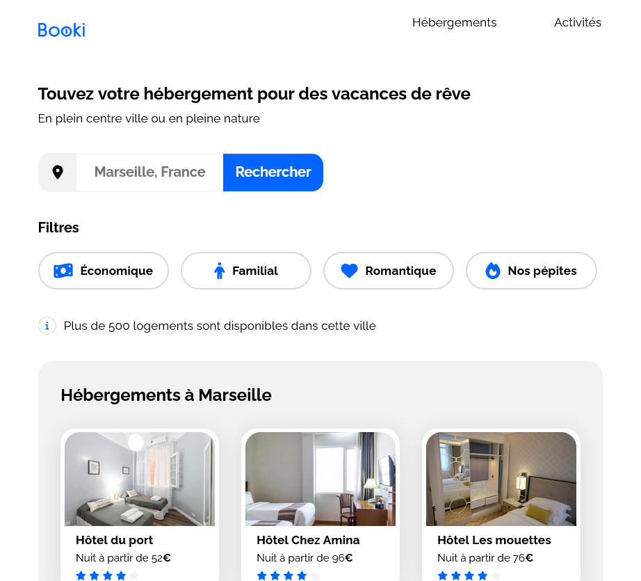
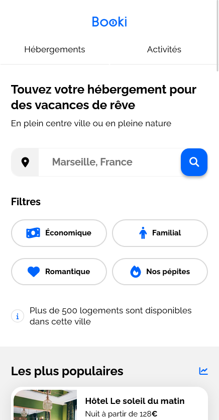

# OpenClassrooms - Booki

This is my solution for the project n°2 - OpenClassrooms - Web Developer training : Booki

## Table of content

-   [overview](#overview)
    -   [The project](#the-project)
    -   [Screenshot](#screenshot)
    -   [Links](#links)
-   [My process](#my-process)
-   [Skills evaluated](#skills-evaluated)

## Oveview

### The project

-   Project : Develop a website allowing users to search for accomodation and activities based on the city entered.

-   Goal : Develop a first site version in order to validate the interface.

### Screenshot

### Links

-   Live Site URL: [https://amalynn.github.io/oc-iw-p3-booki/](https://amalynn.github.io/oc-iw-p3-booki/)

## My process

This project was built with :

-   Desktop-first approach
-   Responsive layout
-   HTML5
-   CSS3
-   Flexbox
-   CSS Grid
-   CSS custom properties

## Skills evaluated

-   Implement a responsive interface with HTML and CSS
-   Integrate content according to a mockup with HTML and CSS
-   Versioning your project with Git and GitHub
-   Install a frontend development environment

